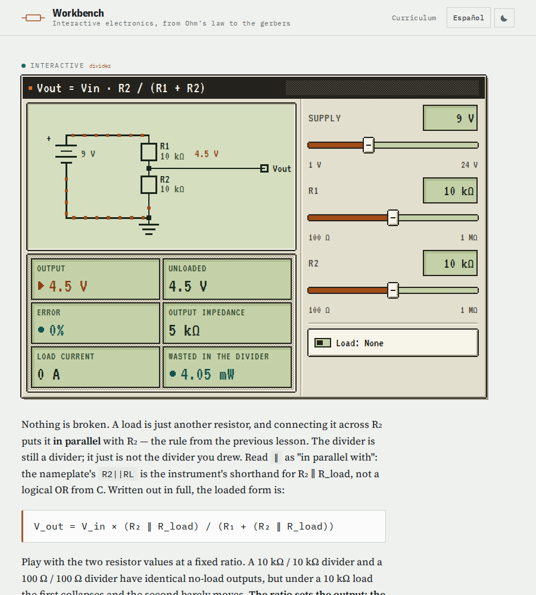
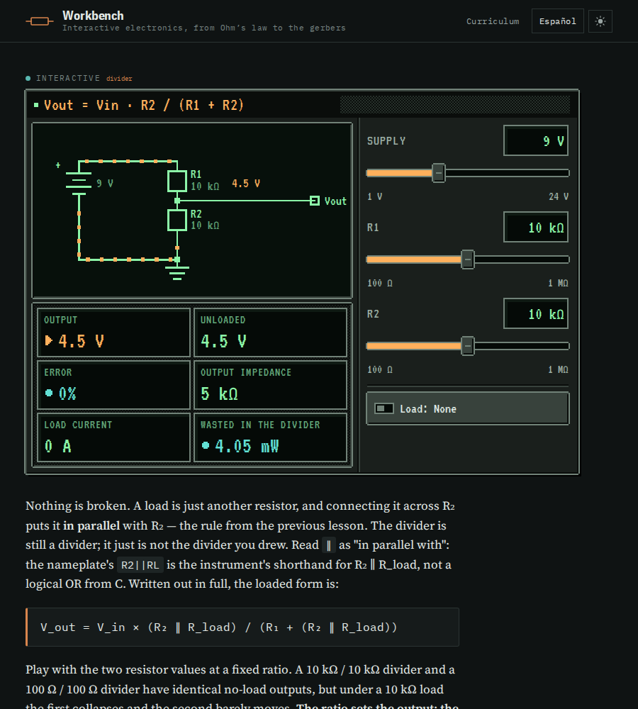
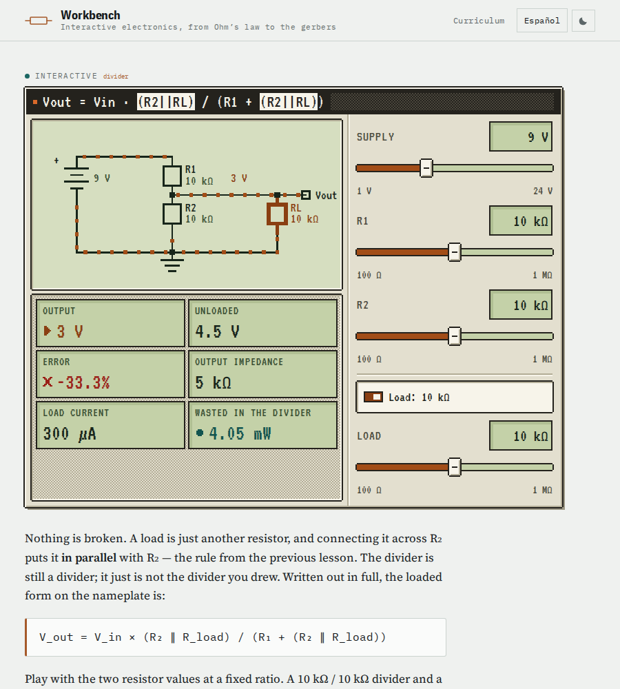
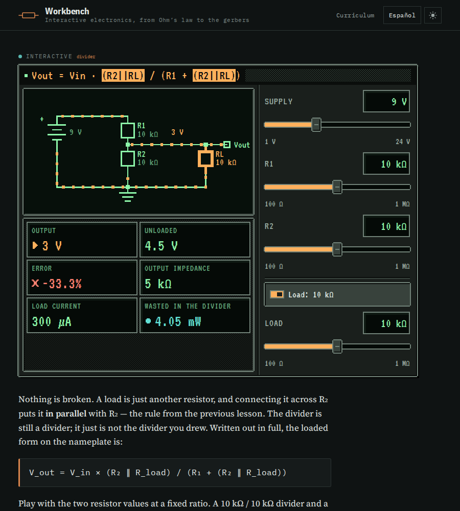
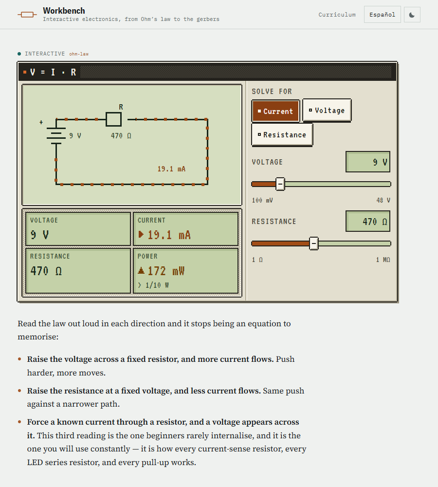
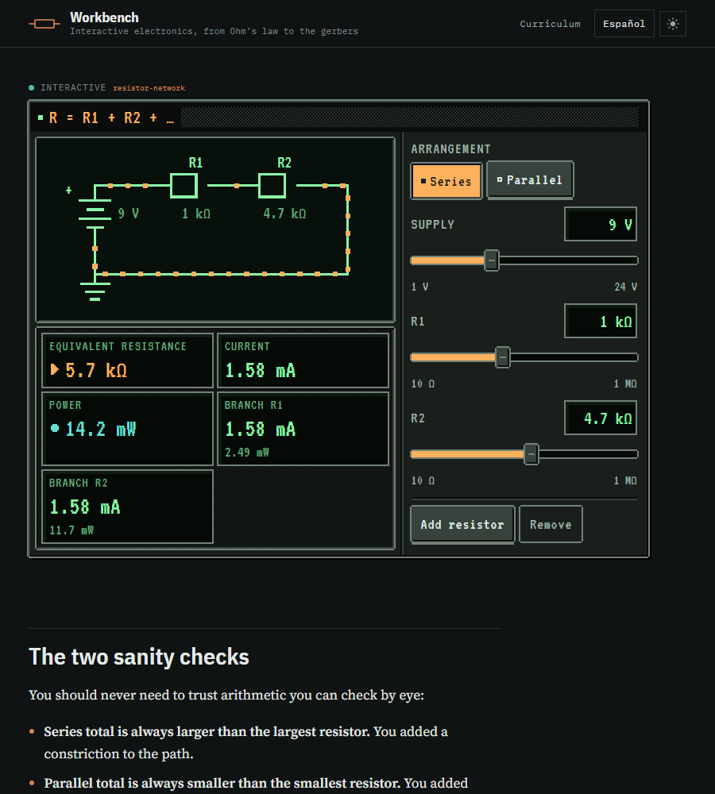
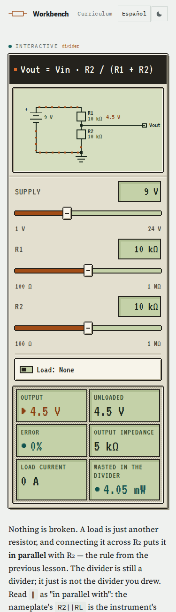
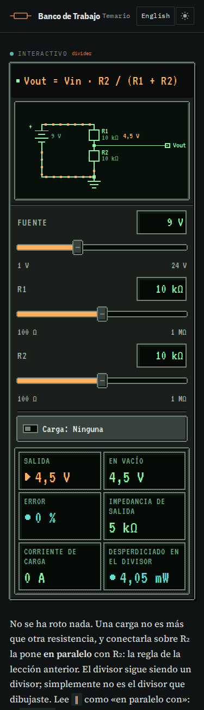

# Pixel-art instrument skin

**Concept.** The lesson reads like a textbook. Each instrument looks like a
piece of 8/16-bit bench gear sitting in that textbook: a putty-cased meter with
a green LCD in light mode, a gunmetal CRT rig with phosphor green and amber in
dark mode.

The prose (serif body, IBM Plex, callouts, masthead, home and module pages) has
not changed. The skin only applies inside `.pix`, which is the host class of
`app-panel`.

| | |
|---|---|
|  |  |
|  |  |
|  |  |
|  |  |

Screenshots come from the prerendered `dist/electronics/browser` output. A copy
of that folder is served from WSL with `python3 -m http.server`, and Playwright
drives headless Microsoft Edge (`channel="msedge"`) on the Windows host, because
WSL has no browser. The lesson header and the prose before the first instrument
are hidden so the instrument sits under the masthead. Desktop shots are
900 × 1000 px and phone shots are 375 × 1300 px, at device scale 1. "Dark" uses
`prefers-color-scheme: dark` with no stored theme. The six divider shots were
retaken for the loaded nameplate and its reserved size (see
[Nameplate formulas](#nameplate-formulas-the-loaded-divider)) with the same
framing, but with the Playwright Chromium in `~/.a11y-tools` inside WSL (the
one `tools/axe-check.mjs` uses), so their text antialiasing differs slightly
from the two Edge shots of the other instruments.

---

## Where it lives

| File | Role |
|---|---|
| `src/styles/_pixel.scss` | Tokens (palette, `--px`, type sizes, composite bevels) for all three theme states, slot layout for `[panelControls]` / `[panelReadouts]`, and the kit classes `pix-key`, `pix-segment`, `pix-switch`, `pix-rule`. Pulled in by `@use 'styles/pixel'` at the top of `src/styles.scss`. |
| `src/app/ui/panel.ts` | Adds `host: { class: 'pix' }`, which is the scope root. Draws the case, nameplate, recessed screen, engraved groove and dithered readout bay, and lays them out with a container query on the panel's own width (see [Layout](#layout)). `heading` takes a string, or an array of `{ text, accent? }` runs where an accent run is set in inverse video. The optional `headingLabel` is the heading's spoken form: when set, the visible formula is `aria-hidden` and the label is read instead. The optional `headingAlt` is the heading's other form: both share one grid cell, the inactive one `visibility: hidden` and `aria-hidden`, so the strip always has the larger form's size and switching moves nothing. Without `headingAlt` nothing is reserved and the rendering is unchanged (a plain-string heading gains only a wrapper ``). |
| `src/app/ui/control.ts` | Pixel fader and LCD entry field. |
| `src/app/ui/readout.ts` | LCD window plus a pixel glyph for each tone. |
| `src/app/schematic/schematic.ts` | Crisp rendering, whole-unit strokes, square caps and mitred joins, square junctions and terminals, stepped current flow. |
| `src/app/widgets/*` | Each widget lost its local copies of mode buttons, toggle, action buttons and readout strip. They use the kit classes now. |
| `src/index.html` | Adds `family=VT323`, `family=JetBrains+Mono` and `family=Iosevka+Charon+Mono` to the existing Google Fonts `<link>`. That is still one stylesheet request. Font files are fetched per glyph range, only when a glyph on screen needs them (see [Glyph coverage](#glyph-coverage)). |

---

## Tokens

### Unit and type

| Token | Value | Notes |
|---|---|---|
| `--px` | `2px`, or `3px` at `min-width: 1200px` | Drives every border, bevel, offset, gap and icon size. Always write `calc(n * var(--px))`. Do not hard-code pixel values. |
| `--pix-font` | `'VT323', 'JetBrains Mono', 'Iosevka Charon Mono', var(--mono)` | Labels, readouts, keys and schematic text only. The second and third families supply only the glyphs VT323 lacks. See [Glyph coverage](#glyph-coverage). |
| `--pix-text-sm` | `18px` | Readout labels, slider bounds. |
| `--pix-text` | `20px` | Control labels, legends, keys, readout notes. |
| `--pix-text-lg` | `25px` | Panel heading and LCD entry field. 25 px puts VT323's 0.08 em pixel on an exact 2 px grid. |
| `--pix-text-xl` | `32px` | Readout values. Cap height is about 18 px. |
| `--pix-sch-text` | `14px` (SVG user units), `16px` at `max-width: 520px` | Schematic labels. 14 units takes up about the same space as the old 10 px Plex Mono, so no symbol coordinates had to move. On phones the drawing is under about 340 px wide, so 14 units rendered at 13.5 px. 16 units renders at 15.4–17.7 px at 375 px, with no label collisions. From 521 px up the drawing is wide enough (labels 17–25 px). |

### Composite tokens

| Token | Meaning |
|---|---|
| `--pix-raised` | Inset bevel: `--pix-hi` top-left, `--pix-lo` bottom-right. |
| `--pix-sunken` | The same bevel reversed. |
| `--pix-edge` | One-unit outline in `--pix-line`, drawn as four offset shadows. The corners are left empty, which gives a notched pixel corner without using `border-radius`. |
| `--pix-drop` | A hard `2u × 2u` drop shadow in `--pix-shadow`. No blur. |

These are declared once on `.pix`. They follow theme and breakpoint changes
automatically, because a custom property resolves its `var()` references using
the final values on the element that declares it. If a descendant overrides a
palette entry such as `--pix-hi`, it must `@include pix-composites` again.

### Palette

The palette is built from the prose roles (copper, signal, warn, danger, ink,
surface), cut down to a few steps per theme. Dark is a separate palette, not an
inversion of light.

| Role | Token | Light (putty + LCD) | Dark (gunmetal + CRT) |
|---|---|---|---|
| Case | `--pix-case` | `#e3dfcf` | `#1a1f1c` |
| Bevel highlight | `--pix-hi` | `#f7f4ea` | `#38423c` |
| Bevel shade | `--pix-lo` | `#b3ad97` | `#0a0d0b` |
| Outline | `--pix-line` | `#24221d` | `#718278` |
| Drop shadow | `--pix-shadow` | `#9c9784` | `#000000` |
| Ink on case | `--pix-ink` | `#1e1f1a` | `#dfe9e2` |
| Muted ink on case | `--pix-muted` | `#4d4b40` | `#9db0a5` |
| Nameplate | `--pix-plate` / `--pix-plate-ink` | `#24221d` / `#f7f4ea` | `#0a0d0b` / `#ffb05c` |
| Grille dither (decoration) | `--pix-plate-dither` | `#4a463c` | `#26302a` |
| Power LED (decoration) | `--pix-led` | `#d9692a` | `#8cf5a8` |
| LCD glass | `--pix-lcd` | `#c4d1a8` | `#050a07` |
| LCD inner shade | `--pix-lcd-shade` | `#b0bf93` | `#0f1a13` |
| LCD ink | `--pix-lcd-ink` | `#17251a` | `#8cf5a8` |
| LCD muted | `--pix-lcd-muted` | `#3a4e33` | `#62a87a` |
| Schematic screen | `--pix-screen` | `#d6dec0` | `#07100b` |
| Schematic ink | `--pix-screen-ink` | `#17251a` | `#8cf5a8` |
| Schematic values | `--pix-screen-muted` | `#3a4e33` | `#62a87a` |
| Tone accent (copper) | `--pix-accent` | `#8a3f12` | `#ffb05c` |
| Tone signal | `--pix-signal` | `#12544f` | `#62e0d4` |
| Tone warn | `--pix-warn` | `#764006` | `#ffd75e` |
| Tone danger | `--pix-danger` | `#9a2017` | `#ff8070` |
| Schematic highlight | `--pix-hot` | `#8a3f12` | `#ffb05c` |
| Current-flow blocks | `--pix-flow` | `#a24d17` | `#ffb05c` |
| Fader fill | `--pix-fill` | `#a24d17` | `#ffb05c` |
| Focus ring | `--pix-focus` | `#8a3f12` | `#ffb05c` |
| Pressed key | `--pix-key-on` / `--pix-key-on-ink` | `#8a3f12` / `#f7f4ea` | `#ffb05c` / `#1a1f1c` |

---

## Contrast

Each ratio is computed from the hex values above using the WCAG 2.x
relative-luminance formula. Text must reach 4.5:1. Focus rings, component
boundaries and state indicators must reach 3:1.

| Pair | Light fg / bg | Ratio | Dark fg / bg | Ratio | Need |
|---|---|---|---|---|---|
| Control label | `#4d4b40` / `#e3dfcf` | 6.56 | `#9db0a5` / `#1a1f1c` | 7.31 | 4.5 |
| Panel text / key text | `#1e1f1a` / `#e3dfcf` | 12.42 | `#dfe9e2` / `#1a1f1c` | 13.44 | 4.5 |
| Key text (raised) | `#1e1f1a` / `#f7f4ea` | 15.07 | `#dfe9e2` / `#38423c` | 8.39 | 4.5 |
| Pressed key text | `#f7f4ea` / `#8a3f12` | 6.81 | `#1a1f1c` / `#ffb05c` | 9.24 | 4.5 |
| Panel heading | `#f7f4ea` / `#24221d` | 14.44 | `#ffb05c` / `#0a0d0b` | 10.80 | 4.5 |
| Accented heading run (inverse video) | `#24221d` / `#f7f4ea` | 14.44 | `#0a0d0b` / `#ffb05c` | 10.80 | 4.5 |
| LCD value | `#17251a` / `#c4d1a8` | 9.90 | `#8cf5a8` / `#050a07` | 14.95 | 4.5 |
| LCD label / note | `#3a4e33` / `#c4d1a8` | 5.62 | `#62a87a` / `#050a07` | 7.03 | 4.5 |
| Tone accent | `#8a3f12` / `#c4d1a8` | 4.65 | `#ffb05c` / `#050a07` | 11.03 | 4.5 |
| Tone signal | `#12544f` / `#c4d1a8` | 5.42 | `#62e0d4` / `#050a07` | 12.47 | 4.5 |
| Tone warn | `#764006` / `#c4d1a8` | 5.20 | `#ffd75e` / `#050a07` | 14.37 | 4.5 |
| Tone danger | `#9a2017` / `#c4d1a8` | 5.03 | `#ff8070` / `#050a07` | 8.14 | 4.5 |
| Schematic ink | `#17251a` / `#d6dec0` | 11.45 | `#8cf5a8` / `#07100b` | 14.47 | 4.5 |
| Schematic value | `#3a4e33` / `#d6dec0` | 6.50 | `#62a87a` / `#07100b` | 6.80 | 4.5 |
| Schematic highlight / accent label | `#8a3f12` / `#d6dec0` | 5.38 | `#ffb05c` / `#07100b` | 10.68 | 4.5 |
| Current-flow blocks | `#a24d17` / `#d6dec0` | 4.17 | `#ffb05c` / `#07100b` | 10.68 | 3 |
| Dimmed stroke (`sch--dim`, ink at 0.55 opacity, composited) | `#6d7865` / `#d6dec0` | 3.33 | `#508e61` / `#07100b` | 4.95 | 3 |
| Dimmed label (`sch--dim`, switches to muted ink, opaque) | `#3a4e33` / `#d6dec0` | 6.50 | `#62a87a` / `#07100b` | 6.80 | 4.5 |
| Fader fill vs empty slot | `#a24d17` / `#c4d1a8` | 3.61 | `#ffb05c` / `#050a07` | 11.03 | 3 |
| Outline vs case (field and key edges, fader cap) | `#24221d` / `#e3dfcf` | 11.90 | `#718278` / `#1a1f1c` | 4.11 | 3 |
| Outline vs page | `#24221d` / `#eff1ef` | 14.00 | `#718278` / `#0f1313` | 4.60 | 3 |
| Switch knob, off | `#24221d` / `#c4d1a8` | 9.86 | `#718278` / `#050a07` | 4.91 | 3 |
| Switch knob, on | `#f7f4ea` / `#8a3f12` | 6.81 | `#1a1f1c` / `#ffb05c` | 9.24 | 3 |
| Focus ring on case | `#8a3f12` / `#e3dfcf` | 5.61 | `#ffb05c` / `#1a1f1c` | 9.24 | 3 |
| Focus ring on key / switch face | `#8a3f12` / `#f7f4ea` | 6.81 | `#ffb05c` / `#38423c` | 5.77 | 3 |
| Focus ring on LCD | `#8a3f12` / `#c4d1a8` | 4.65 | `#ffb05c` / `#050a07` | 11.03 | 3 |
| Focus ring on screen | `#8a3f12` / `#d6dec0` | 5.38 | `#ffb05c` / `#07100b` | 10.68 | 3 |
| Focus ring on page | `#8a3f12` / `#eff1ef` | 6.61 | `#ffb05c` / `#0f1313` | 10.35 | 3 |

Every pair passes. The tightest text pair is light-theme accent text on the LCD
(4.65). Do not make `--pix-accent` or `--pix-lcd` any lighter. The tightest
non-text pair is a dimmed stroke in light (3.33). Do not lower the dim opacity
below 0.55.

The layout and glyph changes in this revision add no new colours. The two
dimmed rows are new pairs created by the `sch--dim` change (see
[Motion and texture](#motion-and-texture)). The accented heading run swaps the
nameplate's two existing colours, so it is a new pair but not a new colour.

The bevel, dither, drop shadow, grille and LED are decoration and carry no
information, so they have no contrast requirement. Text never sits on the
LCD inner shade, because the padding is wider than the shade.

Under `prefers-contrast: more`, every "muted" token is set to its full-ink
partner, and the dither and grille textures are switched off.

---

## Font: VT323

Before choosing, I checked each candidate on the four things the instruments
need. The first comparison read each font's `cmap` from the full upstream font
files. The Ω column below has been corrected to what Google Fonts actually
serves (see [Glyph coverage](#glyph-coverage)).

| Face | Ω (U+03A9), as served | µ (U+00B5) | Tabular digits | Verdict |
|---|---|---|---|---|
| **VT323** | **no** (in the upstream file, but not in any served subset) | yes | monospaced (all 0.4 em) | **chosen**, with a Greek fallback |
| Pixelify Sans | no | yes | no (two widths) | Its 5 also reads like a 9 at readout sizes. |
| Silkscreen | no | yes | no | Caps only. Too wide for "Impedancia de salida". |
| Jersey 10 | no | no | no | Missing both unit glyphs. |
| Press Start 2P | yes | yes | yes | Too wide and heavy for anything longer than a word. |
| Tiny5 | yes | yes | yes | Good coverage, but its 5-pixel letters are too small to read at label sizes. |

VT323 was chosen for these reasons:

- **Numbers stay readable.** It is a terminal face, so every figure is the same
  width and a changing value never shifts sideways. At 32 px the readout digits
  are about 18 px tall.
- **It has every Latin glyph the course uses**: all digits, µ, ×, ·, …, ±, °,
  ², and the Spanish ñ, ¿, ¡, á, é, í, ó, ú.
- **It is cheap.** One family at one weight, about 17 KiB, added to the
  existing Google Fonts `<link>`.

What VT323 does **not** cover, as Google serves it, is everything outside
Latin: Greek (including Ω, so every resistance), arrows, subscripts and ∥. The
earlier version of this document said VT323 "has every glyph the course uses".
That was wrong. Google serves VT323 only as `latin`, `latin-ext` and
`vietnamese` slices, and U+03A9 is in none of them. Until this revision every Ω
in every instrument was drawn by whatever serif or sans face the operating
system picked, because the old fallback, IBM Plex Mono, is also served without
Greek. The fallback chain below fixes that.

VT323 has no geometric shapes (no ▲ ● ■ ✕). That is why the tone glyphs and
the key LEDs are drawn as SVG and CSS rather than typed as characters.

### Glyph coverage

`--pix-font` is now `'VT323', 'JetBrains Mono', 'Iosevka Charon Mono',
var(--mono)`. The browser picks a font per character, so VT323 still draws
every Latin character and the two fallbacks only draw what VT323 lacks.

- **JetBrains Mono, for Greek.** Its Greek slice is 4 KiB, and it is the only
  slice it ever contributes: VT323 covers all of its Latin. Because Ω appears
  in every instrument, this slice is fetched on every lesson with an
  instrument, and it is the only extra font cost on those pages.
- **Iosevka Charon Mono, for ∥, arrows and subscripts.** These glyphs only
  exist in Google's `math` and `symbols` slices, and no Google-hosted pixel or
  mono face with a small Greek slice serves them. Iosevka's `math` slice
  (81,740 bytes, measured) holds ∥ and ₀–₉, and its `symbols` slice
  (63,372 bytes) holds → and ←. Each slice is fetched only when one of its
  glyphs is on screen. No module 00 instrument uses these glyphs, so today they
  are never fetched; the loaded divider writes `||` for that reason (see
  [Nameplate formulas](#nameplate-formulas-the-loaded-divider)).
- **IBM Plex Mono** (`--mono`) stays last, as the face used if the Google
  request fails altogether.

`font-size-adjust: 0.4` on `.pix` scales every fallback to VT323's x-height.
With that, a JetBrains Mono capital is 0.53 em tall (VT323's caps are 0.56 em),
and an Iosevka cell is 0.385 em wide (VT323's is 0.40 em). So Ω and τ sit on
the same cap line as the digits beside them, and a Greek letter takes about
one VT323 cell. If VT323 is slow or blocked, the same rule keeps the panel from
reflowing when it arrives.

I rendered four candidate Greek fallbacks next to VT323 at 14, 18, 25 and
32 px: Iosevka Charon Mono, JetBrains Mono, Noto Sans Mono and Fira Code. I
also tried the pixel faces Tiny5 and Handjet. The two pixel faces looked
blotchy at 14–18 px, because their pixel grid does not match VT323's and lands
on fractional device pixels. Their β and θ were also hard to read. The smooth
monospaced faces were all legible. JetBrains Mono was the best of them on
weight and cap height. It also has the smallest Greek slice that does not
share a range with a heavier slice. Iosevka's Greek letters sit in the same
80 KiB `math` slice as ∥, so using Iosevka for Greek would cost 80 KiB on every
page.

Coverage of the glyphs future instruments need, read with fontTools from the
woff2 files that the CSS2 API serves to Chromium. A glyph counts only if it is
in a slice's `unicode-range` **and** in that slice's `cmap`. The "Drawn by"
column was confirmed in headless Edge by watching which font files load
(`page.on('response')`) for test strings.

| Glyph | Code point | VT323 | JetBrains Mono | Iosevka Charon Mono | IBM Plex Mono | Drawn by |
|---|---|---|---|---|---|---|
| Ω | U+03A9 | no | yes | yes | no | JetBrains Mono (`greek`, 4 KiB) |
| µ | U+00B5 | yes | yes | yes | yes | VT323 |
| τ | U+03C4 | no | yes | yes | no | JetBrains Mono |
| β | U+03B2 | no | yes | yes | no | JetBrains Mono |
| θ | U+03B8 | no | yes | yes | no | JetBrains Mono |
| ∥ | U+2225 | no | no | yes | no | Iosevka (`math`, 80 KiB, on demand) |
| → | U+2192 | no | no | yes | no | Iosevka (`symbols`, 62 KiB, on demand) |
| ← | U+2190 | no | no | yes | no | Iosevka (`symbols`, on demand) |
| × | U+00D7 | yes (small) | yes | yes | yes | VT323 (see m-14 below) |
| ₀–₉ | U+2080–2089 | no | no | yes | no | Iosevka (`math`, on demand) |
| á é í ó ú | U+00E1… | yes | yes | yes | yes | VT323 |
| ñ | U+00F1 | yes | yes | yes | yes | VT323 |
| ¿ ¡ | U+00BF, U+00A1 | yes | yes | yes | yes | VT323 |

Other characters the instruments use today (· ± ° ² … — and every digit) are
all VT323. ≈ (U+2248) is only in Iosevka (`math`).

Guidance for instrument strings:

- **Greek is fine**: τ, β, θJA, Ω, π.
- **Prefer `R1`, `V0` to `R₁`, `V₀`.** Subscripts are supported, but a
  subscript in a 14–20 px label renders 5–8 px tall in any face. Plain digits
  in VT323 also match the schematic, which already uses `R1`, `R2`.
- **Prefer `·` to `×`** for multiplication in visible text. VT323's × is a
  small raised x. Keep × in accessible names (`aria-label`, `sch-canvas`
  `label`), because screen readers announce it as "times".
- **∥ and arrows** work, but the first one on a page costs 62–80 KiB. In a
  nameplate formula, write `R2||RL` in VT323 instead, as the loaded divider
  does, and spell the relation out in the spoken form (`headingLabel` and the
  drawing's `label`). A screen reader reads `||` as "vertical bar vertical bar".

### Nameplate formulas: the loaded divider

With the load switched on, the divider's nameplate changes from the ideal
formula to the loaded one, in the lesson's own shape
(`V_out = V_in × (R₂ ∥ R_load) / (R₁ + (R₂ ∥ R_load))`):

| State | Visible (VT323) | Spoken, EN | Spoken, ES |
|---|---|---|---|
| Load off | `Vout = Vin · R2 / (R1 + R2)` | Vout = Vin × R2 / (R1 + R2) | Vout = Vin × R2 / (R1 + R2) |
| Load on | `Vout = Vin · (R2\|\|RL) / (R1 + (R2\|\|RL))` | Vout = Vin × (R2 in parallel with RL) / (R1 + (R2 in parallel with RL)) | Vout = Vin × (R2 en paralelo con RL) / (R1 + (R2 en paralelo con RL)) |

The two `(R2||RL)` runs are accented in inverse video. The phrase comes from
`widget.r2ParallelLoad` in `src/app/i18n/ui.ts`. The spoken form is both the
nameplate's `headingLabel` and the drawing's accessible name.

The options, and why `||` won:

| Option | Bytes | Trade-off |
|---|---|---|
| `∥` (U+2225) | +81,740 (Iosevka `math`) the first time the load is switched on | The correct glyph, but a smooth face inside a pixel nameplate, an 80 KiB fetch for two characters, and a fallback swap (and possible reflow) while it loads. |
| **`\|\|` in VT323** | **0** (VT323 `latin` is already loaded) | **Chosen.** Two full-height VT323 bars read as ∥ at 25 px, match the pixel face and the terminal style, and keep the formula in the lesson's shape. `R2\|\|RL` has no spaces, so it never breaks across lines. |
| `Rp` defined nearby (`Vout = Vin · Rp / (R1 + Rp)`, `Rp = R2\|\|RL`) | 0 | Same length as the ideal formula, so no wrap, but it needs a second line or readout for the definition and no longer matches the prose. |

Layout: the loaded formula is 39 cells against 27. It fits on one line at 900
and 1280 px. At a viewport of 495 px or narrower it wraps once, always at a
space and never inside `R2||RL` (the ideal formula alone would wrap at 365 px
or narrower). At 375 px the break falls before `/ (R1 + (R2||RL))`.

So the Load switch never moves under the reader's finger, the divider passes
the inactive form as the Panel's `headingAlt`. Both forms sit in the same grid
cell (`grid-area: 1 / 1`), and the inactive one is `visibility: hidden` and
`aria-hidden`. The nameplate therefore always takes the larger form's size, at
any width and in either language:

- At 495 px and below the strip is two lines (62 px at 375 px) in both states.
  The ideal form is centred vertically in it.
- Above that it is one line in both states. The ideal form's strip reserves
  the loaded form's width too, so the grille is 12 cells shorter than it was,
  and its edge does not jump sideways on toggle either.
- An earlier version let the strip grow from 37 to 62 px on toggle at 366–495 px,
  which moved the switch 25 px (REVIEW m-1). That is fixed.

The hidden form is not in the accessibility tree (one heading, named with the
active spoken form) and `window.find()` does not match it, so find-in-page
does not land on invisible text. Measured in Chromium, EN and ES: at 375, 393,
430 and 480 px with the nameplate in view, the switch's `y` and the strip's
height are identical with the load off, on and off again; no horizontal scroll
and no clipped text at 320, 375, 900 or 1280 px in light and dark; forced
colours and reduced motion keep the reserve hidden and the strip the same
size; no Iosevka file is requested with the load on. Ohm's law and
series/parallel, which pass no `headingAlt`, render byte-identically to
`main`.

---

## Layout

The panel's `<section class="panel">` is a size container
(`container: panel / inline-size`). The split depends on the panel's own
width, not the viewport's, so an instrument in a narrower column behaves
correctly. The three slots are siblings in one grid, in DOM order figure,
controls, readouts. Tab order is therefore unchanged in every layout.

| Panel width | Layout |
|---|---|
| under 680 px | One column: screen, then controls, then the readout bay. The screen spans the panel. The drawing is capped at 480 px wide (`.pix [panelFigure]`), so on a tablet it does not grow to 600+ px and push the controls off screen. |
| 680 px and wider | Two columns, `3fr` / `minmax(250px, 2fr)`. Left: the screen (row 1) with the readout bay under it (row 2). Right: the controls, spanning both rows. |

In the two-column layout the screen row is `auto` and the bay row is `1fr`.
The controls span both rows, so any extra height they need goes into the bay
row and never into the screen row. The screen therefore always hugs the
drawing. The bay stretches to the bottom of the left column, so the space
under the screen is the dithered tray rather than bare case. Putting the
readouts beside the controls also makes the panel shorter. The loaded divider
went from about 800 px to about 600 px tall at 900 px. The drawing, the
readouts and the control being dragged are all in view at once, so the sticky
figure the review suggested was not needed.

The review's two suggestions, and why this layout won:

- *`align-self: start` plus sticky* fixed the fill (86 %), but left a bare
  case area about 300 px tall under the screen on the divider. It also kept
  the panel just as tall.
- *Two columns only at a wider breakpoint* never triggers in a lesson: the
  instrument column is capped at 780 px. So it would have meant one column
  everywhere and a drawing about 760 px wide at 900 px, with the controls a
  screen-height away from it.

Drawing area ÷ screen area, measured in headless Edge (viewport width, EN
lessons):

| Viewport | Divider | Divider, loaded | Ohm's law | Series/parallel |
|---|---|---|---|---|
| 375 px (before → after) | 81 % → 81 % | 81 % → 81 % | 81 % → 81 % | 80 % → 80 % |
| 700 px | 34 % → 70 % (stacked) | 26 % → 70 % | 39 % → 70 % | 26 % → 70 % |
| 760 px | — → 85 % | — → 85 % | — → 85 % | — → 84 % |
| **900 px** | **42 % → 86 %** | **33 % → 86 %** | **56 % → 86 %** | **33 % → 86 %** |
| 1280 px | 36 % → 80 % | 28 % → 80 % | 42 % → 80 % | 28 % → 79 % |

At 900 px the drawing also grew from 371 × 192 to 430 × 222 px, because the
left column now takes three fifths of the panel. Schematic labels went from
16.8 to 19.4 px. With four parallel resistors the network drawing is wide and
short, so its screen is short. The bay then takes most of the left column,
which is expected.

---

## Non-colour cues

| State | Cue besides colour |
|---|---|
| Readout tone `accent` (the answer) | Pixel arrow ▶ before the value |
| Readout tone `signal` (nominal) | Pixel dot ● |
| Readout tone `warn` | Pixel triangle ▲ |
| Readout tone `danger` | Pixel cross ✕ |
| Selected radio key (`pix-segment`) | Pressed bevel, key moves down 1 unit, LED square goes from hollow to filled. The LED is drawn with `border` and `background` and has `forced-color-adjust: none`, so it also shows in forced-colours mode, painted `ButtonText`. |
| Switch on/off | Knob changes side. The label text also states the value. |
| Schematic highlight | Stroke goes from 2 to 4 units thick. It is an even width, so on whole-unit coordinates both edges land on unit boundaries. The old 3-unit stroke rendered as 2 or 4 device pixels depending on scale. |
| Schematic dim | Strokes drop to 0.55 opacity. Labels switch from ink to muted ink. |

The tone glyphs are 7×7 grids of whole rectangles, drawn with
`shape-rendering: crispEdges` and marked `aria-hidden`. They are for sighted
readers who cannot tell the colours apart. The value text already carries the
meaning.

---

## Motion and texture

- **Current flow** is a row of 4-unit square blocks with 10-unit gaps. They
  jump forward 4 units per frame using `steps(7)` over a 28-unit cycle, so the
  loop has no visible seam. Speed still scales with the current.
- **Dimming** a symbol (`[dim]="true"`) fades only its strokes and fills, to
  0.55 opacity (3.33:1 light, 4.95:1 dark), in `steps(2)`. Its text never goes
  transparent. Labels switch to `--pix-screen-muted`, which is still 6.5:1 or
  better. The old rule faded the whole group to 0.28, which put dimmed labels
  at 1.5–2.1:1. Current-flow blocks on a dimmed wire stay at full strength.
- Under **`prefers-reduced-motion: reduce`** there is no flow animation and no
  dim transition. The dashes stay as a still dotted overlay, and the dither
  and grille textures are removed.
- **Textures** appear in only two places, and both are areas with no text: the
  speaker grille in the nameplate and the checkerboard behind the readouts. Both
  are switched off under reduced motion and under `prefers-contrast: more`.
- **`forced-colors: active`** strips every `box-shadow`, and that is where the
  pixel borders live. In that mode real `border`s come back on the panel,
  screen, bay, readouts, keys, switch and entry, and the range and checkbox go
  back to `appearance: auto`.

---

## Adopting the skin in a new widget

1. **Wrap the instrument in `<app-panel>`.** That one step applies the scope,
   the tokens, the case, the screen and the bay. An instrument that cannot use
   `Panel` must put `class="pix"` on its root.
2. **Use the slots.** `panelFigure` holds the drawing. `panelControls` holds the
   controls, and the skin stacks them with a `6u` gap. `panelReadouts` holds the
   readouts, and the skin arranges them in an auto-fit grid. On a wide panel
   that grid sits under the screen, about 440 px wide, which gives two
   readouts per row. Do not add your own layout CSS to these wrappers. Do not
   size the drawing either: the panel makes the screen hug it.
3. **Use the shared parts.** Sliders go in `app-control`, numbers go in
   `app-readout` with a `tone`, and circuits use `sch-*`. You get the fader, the
   LCD field, the tone glyphs and crisp stepped schematics automatically.
4. **For any other control, use the kit classes**, always on a native element:
   - `<fieldset class="pix-segment"><legend>…</legend><label class="pix-key" [class.pix-key--on]="…"><input type="radio" …/>…</label></fieldset>`
   - `<button type="button" class="pix-key">…</button>`
   - `<label class="pix-switch" [class.pix-switch--on]="on()"><input type="checkbox" …/>Label: {{ state }}</label>`
   - `class="pix-rule"` for an engraved separator above a group of controls.
5. **Widget-specific CSS must only read tokens.** Write sizes as
   `calc(n * var(--px))`, colours as `var(--pix-*)` and fonts as
   `var(--pix-font)`. Never use `border-radius`, never blur a shadow, and never
   read prose tokens (`--surface`, `--rule`, `--copper`…) inside an instrument.
6. **New colours go into both mixins in `_pixel.scss`**, with their contrast
   ratios added to the table above.
7. **New schematic symbols** should use whole-unit coordinates and even stroke
   widths, `class="stroke"` or `class="fill"`, and rectangles rather than
   circles. Text should use the `label` and `value` classes.
8. **Check the strings against [Glyph coverage](#glyph-coverage).** Greek is
   fine. Prefer `R1` to `R₁`, and `·` to `×` in visible text.
9. **Check at 375 px** (no horizontal scroll, tap targets at least 44 px), in
   both themes, and with reduced motion turned on.

---

## Before and after, per component

**Panel**
- *Before:* 1 px `--rule` border on `--surface`, a sans-serif heading, and hairline dividers.
- *After:* a raised case with a notched one-unit outline and a hard drop shadow. The
  heading sits in a dark nameplate with a power LED and a dithered grille. The drawing
  sits on a recessed screen. Controls are separated by an engraved groove. Readouts sit
  in a sunken, dithered bay. The host now carries `.pix`.
- *Layout revision:* the screen used to be a grid cell stretched to the height of the
  controls column, so at 900 px the drawing filled 33 % of it on the divider and on
  series/parallel. Now the panel is a container: below 680 px it stacks; at 680 px and
  above the screen and the bay share the left column and the controls run down the
  right. The screen hugs the drawing (86 % fill at 900 px). See [Layout](#layout).

**Control**
- *Before:* a 2 px hairline track with a round copper thumb, a small mono text box, and 10–11 px mono labels.
- *After:* a 44 px tall fader. Its 4-unit slot fills with copper up to the cap, using
  `--travel`, which is bound from `position()`. The cap is a square, bevelled keycap with
  a grip line and presses in while you drag. The text box is still a real
  `<input type="text">` with the same keyboard behaviour. It is styled as an LCD field
  (outlined, shaded glass, VT323 at 25 px, 44 px tall). Labels and bounds use VT323 at
  20 / 18 px in place of the old 10–11 px mono.

**Readout**
- *Before:* plain cells separated by 1 px rule-coloured gaps. Tone was colour only.
- *After:* each value is its own LCD window with a dark bezel and shaded glass. Values
  are VT323 at 32 px. Tones map to LCD-safe palette entries and add a pixel glyph. The
  host no longer paints `--surface`.

**Schematic**
- *Before:* 1.6-unit strokes with round caps and joins, round junctions and terminals,
  a smooth `linear` dash flow, and 10 px Plex Mono labels.
- *After:* `shape-rendering: crispEdges`, 2-unit strokes (4 when highlighted), square
  caps and mitred joins, square junction blocks, hollow square terminal pads, square
  current blocks that move in `steps(7)`, and VT323 labels. Colours come from
  `--pix-screen-*` / `--pix-hot` / `--pix-flow`. Outside a panel they fall back to the
  prose tokens, so the library still works on its own. Dimming fades strokes only and
  keeps labels readable (see [Motion and texture](#motion-and-texture)).

**Widgets**
- `divider`: the load toggle is now a `pix-switch` (a native checkbox) sitting under a
  `pix-rule`. The local toggle and readout-strip CSS is gone. The nameplate reads
  `Vout = Vin · R2 / (R1 + R2)`. VT323's × rendered as a small raised x. The drawing's
  accessible name keeps ×, so it is read as "times". With the load on, the nameplate
  shows the loaded form with `(R2||RL)` accented, and the spoken form spells out
  "in parallel with" (see [Nameplate formulas](#nameplate-formulas-the-loaded-divider)).
- `ohm-law`: "Solve for" is now a `pix-segment` of radio keys with LEDs. The local
  `.modes` / `.mode` / `.readouts` CSS (about 60 lines) is gone. The nameplate reads
  `V = I · R`, with × kept in the drawing's accessible name.
- `resistor-network`: the arrangement uses `pix-segment`. Add and remove are `pix-key`
  buttons (raised, with a pressed state and a disabled state) under a `pix-rule`. The
  local CSS (about 80 lines) is gone.

---

## Verification and known gaps

The independent review in `docs/REVIEW.md` §5 has since covered what this
section used to list as unverified. axe reports nothing inside `.pix`. Keyboard
operation, Firefox and WebKit rendering, forced colours and
`prefers-contrast: more` were all checked there. See that section for the
evidence.

This revision (layout, glyph fallback and review follow-ups M-10, M-11, m-14,
m-15, m-16, s-01, s-02):

- `pnpm build` passes: 33 routes prerendered, with no budget warnings.
  `styles.css` is 10.14 kB raw (2.53 kB gzipped).
- Fill was measured in headless Edge at 375, 700, 760, 800, 900 and 1280 px
  (table in [Layout](#layout)). No horizontal scroll at any of those widths.
  Tab order through a panel still follows DOM order. On the four-resistor
  network it runs: radio keys, then each control's text box and slider, then
  Remove.
- A lesson page fetches VT323 (latin, 17 KiB) and JetBrains Mono (greek, 4 KiB)
  for the instruments. It fetches nothing from Iosevka Charon Mono.
  `document.fonts.check('20px "JetBrains Mono"', 'Ω')` is true.
- Forced colours, light and dark: the segment-key LEDs show hollow when off and
  filled when on, in `ButtonText`.
- `sch--dim` is still unused by any widget. The dimmed pairs in the contrast
  table come from the CSS, not from a rendered instance.
- **Not re-verified:** Firefox and WebKit, after the container query and the new
  font stack. Both are supported in current versions, but this revision was only
  rendered in Edge.
- The prose figure caption above each instrument ("INTERACTIVE divider", in
  `lesson-body.ts`) uses `--faint`. REVIEW M-12 found it at 2.74:1 (light) and
  4.20:1 (dark); the token is now `#656e6d` / `#798684`, which gives 4.62:1 on
  the light page and 4.95:1 on the dark one. axe reports 0 violations on every
  route in four theme states (`tools/axe-check.mjs`, REVIEW §0).
